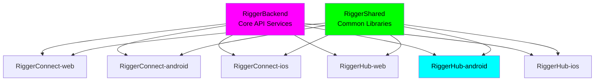

# RiggerHub Android

🏗️ **A ChaseWhiteRabbit NGO Initiative**

## 📍 Repository Location \u0026 Structure\n\n**Current Location**: `/Users/tiaastor/Github/tiation-repos/RiggerHub-android/`\n\nThis repository is part of the **Tiation Enterprise Repository Structure**, specifically designed to house **ChaseWhiteRabbit NGO's** technology initiatives following enterprise-grade development practices.\n\n### 🏗️ Enterprise Ecosystem\n- **Repository Collection**: [Enterprise Repository Index](../ENTERPRISE_REPOSITORY_INDEX.md)\n- **Web Platform**: [RiggerHub-web](../RiggerHub-web/)\n- **Connect Platform**: [RiggerConnect-android](../RiggerConnect-android/), [RiggerConnect-ios](../RiggerConnect-ios/), [RiggerConnect-web](../RiggerConnect-web/)\n- **Backend Services**: [RiggerBackend](../RiggerBackend/)\n- **Shared Libraries**: [RiggerShared](../RiggerShared/)\n\n### 🌟 NGO Integration\nAs a **ChaseWhiteRabbit NGO Initiative**, this project adheres to:\n- ✅ **Enterprise-grade development practices**\n- ✅ **Ethical technology standards**\n- ✅ **Worker empowerment focus**\n- ✅ **DevOps best practices with CI/CD**\n- ✅ **Open development transparency**\n\n## 🎯 Application Overview\n\nRiggerHub Android is an enterprise-grade mobile application serving as the central hub for operations management and coordination among rigger professionals in the construction, oil & gas, and industrial sectors. It provides managers and workers with powerful features for efficient project management and collaboration.

## 🎯 Project Purpose

As part of ChaseWhiteRabbit NGO's mission to enhance 4;ngineering operations, RiggerHub Android offers comprehensive tools to:

- **Manage** large-scale projects and team collaborations
- **Coordinate** resources and personnel for complex tasks
- **Monitor** compliance with modern standards and safety protocols
- **Streamline** communication channels for team-wide updates

## 🔗 Related Repositories

### Core Platform Components

| Repository | Platform | Description | GitHub SSH URL |
|------------|----------|-------------|----------------|
| **RiggerBackend** | API/Backend | Core backend services and APIs for the Rigger ecosystem | `git@github.com:tiation/RiggerBackend.git` |
| **RiggerConnect-web** | Web | Professional networking platform for construction workers | `git@github.com:tiation/RiggerConnect-web.git` |
| **RiggerConnect-android** | Android | Native Android mobile networking application | `git@github.com:tiation/RiggerConnect-android.git` |
| **RiggerConnect-capacitor** | Cross-platform | Cross-platform mobile app built with Ionic Capacitor | `git@github.com:tiation/RiggerConnect-capacitor.git` |
| **RiggerConnect-ios** | iOS | Native iOS mobile networking application | `git@github.com:tiation/RiggerConnect-ios.git` |
| **RiggerHub-web** | Web | Operations management hub for business users | `git@github.com:tiation/RiggerHub-web.git` |
| **RiggerHub-android** | Android | Native Android operations management application | `git@github.com:tiation/RiggerHub-android.git` |
| **RiggerHub-ios** | iOS | Native iOS operations management application | `git@github.com:tiation/RiggerHub-ios.git` |
| **RiggerShared** | Multi-platform | Shared libraries, components, and utilities | `git@github.com:tiation/RiggerShared.git` |

### Enterprise Integration Architecture



### ChaseWhiteRabbit NGO License Framework

All repositories in the Rigger ecosystem are licensed under **GPL v3**, ensuring:
- ✅ **Open Source Transparency**: Complete code visibility and community auditing
- ✅ **Ethical Technology Standards**: Algorithmic fairness and bias prevention
- ✅ **Worker Empowerment Focus**: Technology serving users, not corporate profits
- ✅ **Community Ownership**: Improvements benefit the entire rigger community
- ✅ **Corporate Responsibility**: Commercial use must remain open and accessible

## 🚀 Technology Stack

- **Language**: Kotlin 1.9.20
- **Architecture**: MVVM
- **UI Framework**: Jetpack Compose
- **Minimum Android Version**: API 24 (Android 7.0)
- **Target Android Version**: API 34 (Android 14)

## Project Structure

## Project Structure

```
├── .github/workflows/    # CI/CD pipelines
├── configs/             # Configuration files
├── docs/               # Documentation
│   ├── api/           # API documentation
│   ├── architecture/  # System architecture docs
│   ├── deployment/    # Deployment guides
│   └── development/   # Development guides
├── scripts/           # Build and deployment scripts
├── src/              # Source code
└── tests/            # Test suites
```

## Features

- Native Android hub application
- Ethical, enterprise-grade development practices
- DevOps best practices integration
- Modern, striking UI/UX design
- CI/CD ready architecture

## Quick Start

1. Clone the repository
2. Open in Android Studio
3. Configure build variants
4. Run on device/emulator

## Contributing

Please follow our enterprise development standards and ensure all code meets our ethical guidelines.

## 🤝 Project Team & Purpose

This project is part of a broader suite of repositories aimed at supporting the **transient rigging and heavy lifting industry** in Western Australia and beyond.

🔗 **Related Repositories**:

* [`RiggerConnect-web`](https://github.com/ChaseWhiteRabbit/RiggerConnect-web) - Professional networking platform for construction workers
* [`RiggerConnect-android`](https://github.com/ChaseWhiteRabbit/RiggerConnect-android) - Native Android mobile networking application
* [`RiggerConnect-ios`](https://github.com/ChaseWhiteRabbit/RiggerConnect-ios) - Native iOS mobile networking application
* [`RiggerConnect-capacitor`](https://github.com/ChaseWhiteRabbit/RiggerConnect-capacitor) - Cross-platform mobile app built with Ionic Capacitor
* [`RiggerHub-web`](https://github.com/ChaseWhiteRabbit/RiggerHub-web) - Operations management hub for business users
* [`RiggerHub-android`](https://github.com/ChaseWhiteRabbit/RiggerHub-android) - Native Android operations management application
* [`RiggerHub-ios`](https://github.com/ChaseWhiteRabbit/RiggerHub-ios) - Native iOS operations management application
* [`RiggerShared`](https://github.com/ChaseWhiteRabbit/RiggerShared) - Shared libraries, components, and utilities
* [`RiggerBackend`](https://github.com/ChaseWhiteRabbit/RiggerBackend) - Core backend services and APIs for the Rigger ecosystem

📬 **Contact**:
For questions, ideas, or collaboration inquiries, please reach out to:

* **Jack Jonas** – [jackjonas95@gmail.com](mailto:jackjonas95@gmail.com)
* **Tia** – [tiatheone@protonmail.com](mailto:tiatheone@protonmail.com)

---

### 🙌 About the Founders

**Jack Jonas** is a seasoned rigger, crane operator, and heavy vehicle mechanic based in Karratha, Western Australia. His firsthand experience in the field shapes the practical backbone of this platform.

**Tia** is a Swedish software developer and founder of the NGO **ChaseWhiteRabbit**, which is dedicated to building inclusive, systemic solutions to complex challenges.

Together, they created this SaaS platform to:

* Help connect riggers, doggers, and crane operators to real work opportunities.
* Support better logistics, transparency, and compliance in the field.
* Fund and sustain the good work being done by **ChaseWhiteRabbit** in disadvantaged communities.

## 📧 Contact Information

### Primary Maintainers

For inquiries related to the Rigger ecosystem, please contact our primary maintainers:

- **Jack Jonas**: [jackjonas95@gmail.com](mailto:jackjonas95@gmail.com)
- **Tia Astor**: [tiatheone@protonmail.com](mailto:tiatheone@protonmail.com)

These maintainers oversee the development and coordination of the entire Rigger platform ecosystem, including RiggerConnect, RiggerHub, RiggerBackend, and RiggerShared repositories.

## License

Enterprise license - Contact ChaseWhiteRabbit NGO for usage rights.
